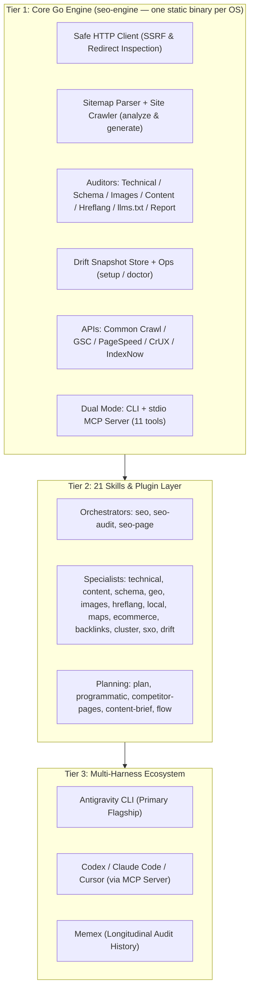

# Antigravity SEO & GEO Suite

A high-performance, **OS-agnostic** SEO and Generative Engine Optimization (GEO) suite built natively for **Google Antigravity CLI & IDE**, powered by a single static **Go engine** (Linux / macOS / Windows) and 21 multi-agent skills.

> [!NOTE]
> **Lineage & Inspiration**: Inspired by [`claude-seo`](https://github.com/AgriciDaniel/claude-seo) by Daniel Agrici, reimagined and re-engineered natively for **Google Antigravity CLI & IDE**. Rather than relying on heavyweight external Python/Playwright runtimes, Antigravity SEO leverages Antigravity's native agent primitives (`search_web`, `read_url_content`, multi-agent subagent swarms, and interactive UI Artifacts) backed by a high-speed, zero-dependency Go engine.

---

## claude-seo + Claude Opus 5 vs. antigravity-seo + Gemini 3.8 Flash

| Dimension / Capability | claude-seo + Claude Opus 5 | antigravity-seo + Gemini 3.8 Flash | Advantage |
|---|---|---|---|
| **Input Token Cost** | $5.00 / 1M tokens | **$0.75 / 1M tokens** | **6.7x cheaper** |
| **Output / Thinking Cost** | $25.00 / 1M tokens | **$3.75 / 1M tokens** | **6.7x cheaper** |
| **Single Page Deep Audit** (~50k in / 10k out) | ~$0.50 | **~$0.075** | **~85% savings** |
| **Full Site Audit (20 Pages + SERP Intel)** (~400k in / 80k out) | **~$4.00 – $8.00+** | **~$0.60** | **~85% – 90% savings** |
| **Multi-Agent Swarm Crawling** | Not supported (single model tier) | **~$0.12 – $0.20** (via `flash_lite`) | **~25x – 40x cheaper** |
| **Live Google SERP Grounding** | ❌ 3rd-party paid MCPs (Brave, Firecrawl, Serper) | ✅ **Native `search_web`** | **Zero-config Google grounding** |
| **Page Semantic Content Extraction** | ❌ Subprocess curl or browser daemons | ✅ **Native `read_url_content`** | **Zero-overhead markdown parsing** |
| **Engine Runtime & Dependencies** | ❌ Python venvs, pip packages, Playwright | ✅ **Single static Go binary (`seo-engine`)** | **Zero dependencies, 10ms startup** |
| **Google Search Console & Backlinks** | ❌ External paid SaaS APIs (Ahrefs/Moz) | ✅ **Native GSC JWT RSA + Common Crawl** | **Zero external subscriptions** |
| **Deliverables & Visual Presentation** | ❌ Terminal text stream / raw markdown | ✅ **Interactive UI Artifacts & PDF / HTML** | **Rich scorecards, Mermaid, PDF** |

*Pricing data based on September 2026 generally available rates. On claude-seo with Claude Opus 5, running deep site-wide audits rapidly consumes monthly session credit pools or API limits; with antigravity-seo on Gemini 3.8 Flash, daily automated audits cost pennies.*

### In-Depth Analysis: Why This Architecture Matters

#### 1. Real-World Cost & Token Economics at Production Scale
- **The Thinking Token Multiplier**: Frontier models like Claude Opus 5 utilize extensive internal reasoning tokens that bill at full output rates ($25.00/1M). In deep technical audits—where an agent inspects DOM structures, validates schema trees, compares SERP features, and evaluates E-E-A-T signals—reasoning traces regularly exceed 20k–50k tokens per run. A comprehensive 20-page audit on Opus 5 readily exceeds **$4.00 – $8.00+**.
- **Gemini 3.8 Flash High Efficiency**: At **$0.75/1M input** and **$3.75/1M output**, Gemini 3.8 Flash delivers comparable analytical rigor for **~$0.60** total—an immediate **85%–90% reduction in operating costs**.
- **Heterogeneous Multi-Agent Swarms**: Antigravity SEO tiers workloads across model specializations. Instead of burning expensive frontier tokens on repetitive page fetching and parsing, the orchestrator fans out parallel crawls to `flash_lite` subagents ($0.10/1M input, $0.40/1M output), bringing the raw data collection phase down to **<$0.15**, while reserving high-context reasoning for synthesis and GEO scoring.

#### 2. Zero-Dependency Go Engine vs. Python / Playwright Bloat
- **Instant Cold Starts (10ms)**: `claude-seo` bundles Python scripts requiring virtual environments, pip dependencies (`beautifulsoup4`, `requests`, `playwright`), and multi-hundred-megabyte browser binaries. Startup latency is measured in seconds.
- **Single Static Binary**: `seo-engine` is compiled into a single self-contained Go binary with zero external runtime dependencies. Commands execute in **<10ms** across Linux (glibc/musl), macOS (Universal), and Windows.
- **Native Browser Primitives**: When full single-page application (SPA) rendering or visual screenshotting is required, Antigravity delegates directly to Antigravity's native browser subsystem—completely eliminating the need to maintain a headless browser daemon in the CLI engine.

#### 3. Native Search Grounding vs. Third-Party Paid MCP Sprawl
- **Zero-Config Google Grounding**: Traditional agent SEO toolsets require users to sign up, configure, and pay for third-party search APIs (Brave Search, Serper, Firecrawl, or DataForSEO) just to inspect competitive SERPs and People Also Ask (PAA) queries.
- **Built-in Grounding**: Antigravity provides native `search_web` (direct live Google search results) and `read_url_content` (high-speed markdown conversion without browser overhead). You get real-time SERP rankings, intent clustering, and competitor page analysis right out of the box with zero subscription keys.

#### 4. Native Google Search Console (JWT RSA) & Public Backlinks
- **Enterprise GSC Integration**: `seo-engine` includes a zero-dependency Google Service Account client (`internal/api/gsc.go`). It mints RS256/PKCS8 JWTs and exchanges them for OAuth2 bearer tokens directly, unlocking Search Analytics (`seo-engine gsc query`) and URL Inspection (`seo-engine gsc inspect`) without client secrets or web redirects.
- **Keyless Backlink Graphing**: Rather than mandating paid Ahrefs or Moz subscriptions, `seo-engine backlinks` queries the public Common Crawl CDX index to extract referring domains and backlink anchor distributions at zero cost.

#### 5. Executive Deliverables: Live UI Artifacts & PDF Generation
- **Beyond Terminal Dumps**: `claude-seo` streams raw text to stdout. Antigravity SEO delivers full executive reports as rich, interactive Antigravity UI Artifacts featuring GitHub alert callouts (`> [!CRITICAL]`, `> [!WARNING]`), tabular audit breakdowns, and Mermaid site hierarchy diagrams.
- **Print-Ready PDF Reports**: Using `seo-engine report <domain>`, the engine synthesizes audit data into a standalone, CSS-styled HTML report with visual score gauge meters and generates production-ready PDFs via `weasyprint` or headless Chrome for client distribution.

---

## Architecture Overview



---

## Installation

### One-Line Install (Recommended — No clone required)

Installs the plugin directly into `~/.gemini/config/plugins/antigravity-seo`, compiles or downloads the engine binary, and validates with `doctor`:

**macOS / Linux:**
```bash
curl -fsSL https://raw.githubusercontent.com/angelotc/antigravity-seo/main/install.sh | bash
```

**Windows (PowerShell):**
```powershell
irm https://raw.githubusercontent.com/angelotc/antigravity-seo/main/install.ps1 | iex
```

*Requirements*: **Go 1.22+** (or prebuilt binary automatically downloaded from GitHub Releases) and `git` / `curl`.

---

### Install from Source (For Contributors)

If you are modifying the engine or skills locally:

**macOS / Linux:**
```bash
git clone https://github.com/angelotc/antigravity-seo.git
cd antigravity-seo
bash install.sh
```

**Windows (PowerShell):**
```powershell
git clone https://github.com/angelotc/antigravity-seo.git
cd antigravity-seo
powershell -ExecutionPolicy Bypass -File install.ps1
```

Set `INSTALL_DIR` to override the plugin target directory (default `~/.gemini/config/plugins`). Set `BIN_DIR` to customize CLI binary symlink location (default `~/.local/bin`).

### Verify

```bash
seo-engine doctor          # runtime state, drift store, adapters, integrations, platform
```

### Uninstall

```bash
bash uninstall.sh              # macOS/Linux (add --purge to drop the data dir too)
powershell -File uninstall.ps1 # Windows (-Purge for the data dir)
```

Uninstallers remove the plugin only — never MCP configs or credentials.

### Manual / engine-only

```bash
go build -buildvcs=false -o bin/seo-engine ./cmd/seo-engine   # append .exe on Windows
./bin/seo-engine setup && ./bin/seo-engine doctor
mkdir -p ~/.gemini/config/plugins && ln -s "$PWD" ~/.gemini/config/plugins/antigravity-seo
```

Cross-compiling for another OS? Standard Go toolchains work:
```bash
GOOS=windows GOARCH=amd64 go build -o bin/seo-engine.exe ./cmd/seo-engine
GOOS=darwin  GOARCH=arm64 go build -o bin/seo-engine ./cmd/seo-engine
```

### Data directory (per-OS defaults, override with `ANTIGRAVITY_SEO_DATA_DIR`)

| OS | Location |
|---|---|
| Linux | `$XDG_DATA_HOME/antigravity-seo` or `~/.local/share/antigravity-seo` |
| macOS | `~/Library/Application Support/antigravity-seo` |
| Windows | `%LOCALAPPDATA%\antigravity-seo` |

---

## Engine Commands (21)

| Command | Purpose |
|---|---|
| `headers <url>` | Status, redirect chains, X-Robots-Tag, header canonical, TTFB |
| `audit <url>` | On-page technical + schema audit |
| `page <url>` | Deep audit: audit + images + content/E-E-A-T + hreflang |
| `report <url>` | Executive audit report in standalone HTML or native PDF (`--pdf`) |
| `schema <url>` | JSON-LD validation vs Google Rich Results (14+ types, deprecated types, placeholders) |
| `images <url>` | Alt coverage, dimensions/CLS, formats, lazy-load, data URIs |
| `content <url>` | Word count, heading tree, byline/date E-E-A-T, answer blocks, keyword density |
| `hreflang <url>` | BCP47 codes, x-default, self-reference, duplicates |
| `llms <url>` | `/llms.txt` + `/llms-full.txt` discovery audit |
| `sitemap <url>` | Sitemap analysis: broken/redirecting URLs, limits |
| `sitemap generate <url>` | Bounded same-origin crawl → XML sitemap (robots-aware, noindex-aware) |
| `robots <url>` | robots.txt incl. AI-crawler policies (Allow/Disallow precedence, wildcards, crawl-delay) |
| `drift baseline\|compare\|history <url>` | Page snapshot monitoring |
| `backlinks <domain>` | Keyless Common Crawl CDX index query (captures, MIME breakdown, indexed pages) |
| `gsc query\|inspect` | Google Search Console Search Analytics and URL Inspection (JWT service account or access token) |
| `psi <url>` | Google PageSpeed Insights (lab + CrUX field CWV) — needs `GOOGLE_API_KEY` |
| `crux <url>` | Chrome UX Report p75 field data (`--history` for 25 weeks) — needs `GOOGLE_API_KEY` |
| `indexnow <url...>` | IndexNow submission (Bing/Yandex/Seznam/Naver) — needs `INDEXNOW_KEY` (`--gen-key` bootstraps) |
| `setup` / `doctor` | Runtime initialization / readiness check |
| `lint-schema-file <path>` | JSON-LD quality gate (used by the PostToolUse hook) |
| `serve-mcp` | MCP server over stdio (11 tools) |

All audit commands support `--json`. Integrations degrade gracefully with setup instructions when keys are absent — the engine core is 100% keyless.

## Skills (21)

Orchestrators: `seo`, `seo-audit`, `seo-page`
Specialists: `seo-technical`, `seo-content`, `seo-schema`, `seo-geo`, `seo-drift`, `seo-images`, `seo-hreflang`, `seo-local`, `seo-maps`, `seo-ecommerce`, `seo-backlinks`, `seo-cluster`, `seo-sxo`
Planning: `seo-plan`, `seo-programmatic` (30/50 doorway gates), `seo-competitor-pages`, `seo-content-brief`, `seo-flow`

Skills reference the engine as `seo-engine`; resolve it to `<plugin-root>/bin/seo-engine` (`seo-engine.exe` on Windows) per `rules/AGENTS.md`.

## Schema Lint Hook (PostToolUse quality gate)

The plugin ships a hook that lints JSON-LD on every file write — blocking placeholders (`[Business Name]`, `REPLACE_*`, `TODO`) and deprecated types (HowTo, SpecialAnnouncement, ClaimReview, VehicleListing, EstimatedSalary, LearningVideo, CourseInfo); warning on invalid JSON or missing `@context`/`@type`.

- **macOS/Linux:** `hooks/schema_linter.sh` (configured in `hooks.json`)
- **Windows:** `hooks/schema_linter.ps1` — swap the `hooks.json` command to
  `powershell -NoProfile -ExecutionPolicy Bypass -File ./hooks/schema_linter.ps1`

Exit contract: 0 = clean (`{}` on stdout), 2 = block, findings on stderr.

---

## MCP Server Integration

The engine speaks MCP over stdio for other assistants. Replace `<ENGINE_PATH>` with your absolute engine path — see `adapters/`:

### Codex CLI (`~/.codex/config.toml`)
```toml
[mcp_servers.seo]
command = "<ENGINE_PATH>"
args = ["serve-mcp"]
```

### Cursor (`.cursor/mcp.json`)
```json
{
  "mcpServers": {
    "seo": { "command": "<ENGINE_PATH>", "args": ["serve-mcp"] }
  }
}
```

MCP tools: `seo_inspect_headers`, `seo_audit_page`, `seo_inspect_sitemap`, `seo_inspect_robots`, `seo_inspect_schema`, `seo_audit_images`, `seo_audit_content`, `seo_audit_hreflang`.

## Optional API Integrations

| Integration | Key | Enables |
|---|---|---|
| Google Search Console | `GOOGLE_APPLICATION_CREDENTIALS` or `GSC_ACCESS_TOKEN` (free) | `gsc query`, `gsc inspect` — Search Analytics & URL inspection |
| Google PageSpeed + CrUX | `GOOGLE_API_KEY` (free) | `psi`, `crux` — real-user CWV field data |
| IndexNow | `INDEXNOW_KEY` (free) | `indexnow` — instant submission to Bing/Yandex/Seznam/Naver |

Paid third-party backlink/keyword MCP servers (Moz, Ahrefs, DataForSEO, SE Ranking) are intentionally out of scope — keyless Common Crawl (`seo-engine backlinks`) and SERP clustering (`skills/seo-cluster`) are built in.

---

## Parity Matrix vs [claude-seo](https://github.com/AgriciDaniel/claude-seo)

| Upstream capability | Here |
|---|---|
| `/seo setup` + `/seo doctor` runtime | ✅ `setup` / `doctor` (Go runtime; no Python venv) |
| install.sh / install.ps1 / uninstallers | ✅ all four scripts |
| technical / page / schema / sitemap / robots audits | ✅ engine commands |
| sitemap **generate** | ✅ `sitemap generate` |
| images / hreflang / content (E-E-A-T) / geo / llms.txt | ✅ engine commands + skills |
| Schema PostToolUse lint hook | ✅ bash + PowerShell |
| drift baseline/compare/history | ✅ JSON snapshots (SQLite-free) |
| PageSpeed / CrUX / IndexNow | ✅ key-gated with graceful degradation |
| Google Search Console (GSC) | ✅ `gsc query` + `gsc inspect` (JWT service account or access token) |
| PDF report generation | ✅ `seo-engine report <url> [--pdf]` (HTML + WeasyPrint / Chromium print) |
| Common Crawl backlink graph | ✅ `seo-engine backlinks <domain>` (open CDX index query, keyless) |
| local / maps / ecommerce / cluster / sxo / plan / programmatic / competitor-pages / content-brief / flow | ✅ skills (prompt + engine + `search_web`) |
| FAQ/deprecated-type tracking | ✅ schema validator + lint hook |
| Python/Playwright SPA rendering & screenshots | ❌ (engine is static-HTML; use Antigravity's browser tools) |
| GA4/Ads OAuth, Moz/Ahrefs/DataForSEO/SE Ranking/Profound/Firecrawl MCPs | ❌ (out of scope; keyless alternatives provided) |
| SQLite drift DB | 🔁 JSON snapshot store (zero-dep) |

## Development

```bash
go build ./... && go vet ./... && go test ./...   # all packages
go mod tidy                                       # keep dependency graph clean
```

Single dependency: `golang.org/x/net` (HTML parsing). SSRF-guarded HTTP client (private/loopback/metadata/CGNAT ranges blocked), manual redirect-chain capture, per-OS data dirs.

## License

MIT — see [LICENSE](LICENSE).
