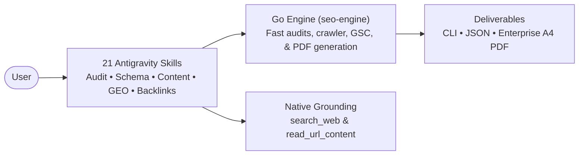

# Antigravity SEO & GEO Suite

An SEO and Generative Engine Optimization (GEO) suite for **Google Antigravity**, powered by Go.

> [!NOTE]
> **Lineage**: Inspired by [`claude-seo`](https://github.com/AgriciDaniel/claude-seo) by Daniel Agrici. Antigravity SEO replaces Python/Playwright runtimes with a single Go binary (`seo-engine`) and native agent tools (`search_web`, `read_url_content`).

---

## claude-seo + Claude Opus 5 vs. antigravity-seo + Gemini 3.8 Flash

| Dimension | claude-seo + Claude Opus 5 | antigravity-seo + Gemini 3.8 Flash | Advantage |
|---|---|---|---|
| **Input / Output Token Cost** | $5.00 / $25.00 per 1M | **$0.75 / $3.75 per 1M** | **6.7x cheaper** |
| **Single Page Audit** (~50k in / 10k out) | ~$0.50 | **~$0.075** | **~85% savings** |
| **Full Site Audit** (20 pages, ~400k in / 80k out) | **~$4.00 – $8.00+** | **~$0.60** | **~85% – 90% savings** |
| **Multi-Agent Swarm Crawls** | Not supported (single model tier) | **~$0.12 – $0.20** (via `flash_lite`) | **~25x – 40x cheaper** |
| **Live SERP & Crawl Data** | Optional paid SaaS MCPs (DataForSEO, Firecrawl, Ahrefs) | ✅ **Native `search_web` & Common Crawl** | **Zero paid subscriptions** |
| **Engine Runtime** | Python venv, pip dependencies, Playwright | ✅ **Single Go binary (`seo-engine`)** | **Zero dependencies, 10ms startup** |
| **Google Search Console** | External Node/Python scripts | ✅ **Native RSA JWT exchange** | **Built-in auth & queries** |

*Pricing based on September 2026 rates. Multi-agent crawls fan out to `flash_lite` subagents for penny-scale execution.*

### Key Architectural Differences

1. **Token Economics**: Claude Opus 5 thinking traces bill at $25/1M, making multi-page audits costly ($4–$8+). Gemini 3.8 Flash ($0.75 / $3.75) cuts costs by 85–90% (~$0.60), while `flash_lite` subagent swarms handle raw crawling for <$0.15.
2. **Zero-Dependency Go Engine**: `seo-engine` is a standalone binary with 10ms execution, eliminating Python venvs, pip modules, and headless browser daemons.
3. **Native Grounding**: Live Google SERP analysis and markdown extraction use Antigravity's built-in `search_web` and `read_url_content` without paid third-party MCPs.
4. **Built-in GSC & Backlinks**: Direct RSA/PKCS8 JWT authentication for Google Search Console and keyless Common Crawl CDX index lookups.
5. **Native A4 PDF Reports**: Built-in PDF report generation (`--pdf`) via `fpdf` matching executive print standards with zero external dependencies.

---

## Architecture



---

## Installation

### One-Line Install (Recommended)

**macOS / Linux:**
```bash
curl -fsSL https://raw.githubusercontent.com/angelotc/antigravity-seo/main/install.sh | bash
```

**Windows (PowerShell):**
```powershell
irm https://raw.githubusercontent.com/angelotc/antigravity-seo/main/install.ps1 | iex
```

Installs the plugin to `~/.gemini/config/plugins/antigravity-seo` and symlinks `seo-engine` into your PATH.

### Install from Source

```bash
git clone https://github.com/angelotc/antigravity-seo.git
cd antigravity-seo
bash install.sh          # On Windows: powershell -ExecutionPolicy Bypass -File install.ps1
```

Verify anytime with:
```bash
seo-engine doctor
```

---

## Commands

| Command | Purpose |
|---|---|
| `headers <url>` | HTTP status, redirect chains, X-Robots-Tag, TTFB |
| `audit <url>` | On-page technical + schema audit |
| `page <url>` | Deep audit (technical + schema + images + content + hreflang) |
| `report <url>` | Executive HTML or native A4 PDF report (`--pdf`) |
| `schema <url>` | JSON-LD validation vs Google Rich Results (14+ types) |
| `images <url>` | Alt coverage, dimensions, CLS, formats, lazy loading |
| `content <url>` | Word count, headings, E-E-A-T signals, answer blocks |
| `hreflang <url>` | BCP47 codes, x-default, self-reference, duplicates |
| `llms <url>` | `/llms.txt` and `/llms-full.txt` AI discovery audit |
| `sitemap <url>` | Sitemap validation (or `sitemap generate <url>`) |
| `robots <url>` | Robots.txt directives and AI crawler access policies |
| `drift <url>` | Change monitoring: `baseline`, `compare`, `history` |
| `backlinks <domain>` | Free Common Crawl link graph and domain captures |
| `gsc query\|inspect` | Google Search Console Search Analytics and URL Inspection |
| `psi <url>` / `crux <url>` | PageSpeed Insights and Chrome UX Report field data |
| `indexnow <url...>` | Instant submission to Bing, Yandex, Seznam, and Naver |
| `serve-mcp` | Run as an MCP server over stdio (11 tools) |

All commands support `--json`. Core audit features are 100% keyless.

---

## Skills (21)

- **Orchestration**: `seo`, `seo-audit`, `seo-page`
- **Technical & Content**: `seo-technical`, `seo-content`, `seo-schema`, `seo-geo`, `seo-images`, `seo-hreflang`, `seo-drift`, `seo-backlinks`
- **Search & Local**: `seo-local`, `seo-maps`, `seo-ecommerce`, `seo-cluster`, `seo-sxo`
- **Strategy**: `seo-plan`, `seo-programmatic`, `seo-competitor-pages`, `seo-content-brief`, `seo-flow`

The plugin also includes a **PostToolUse schema hook** that automatically validates JSON-LD files upon write, blocking deprecated schemas and placeholder text.

---

## MCP Server Integration

To use `seo-engine` with other editors or harnesses (Codex, Cursor, Claude Code):

**Codex CLI (`~/.codex/config.toml`):**
```toml
[mcp_servers.seo]
command = "seo-engine"
args = ["serve-mcp"]
```

**Cursor (`.cursor/mcp.json`):**
```json
{
  "mcpServers": {
    "seo": { "command": "seo-engine", "args": ["serve-mcp"] }
  }
}
```

---

## Upstream Parity vs [claude-seo](https://github.com/AgriciDaniel/claude-seo)

| Upstream Capability | Antigravity SEO Implementation |
|---|---|
| Runtime & Doctor | ✅ Pure Go runtime; zero Python venv |
| Audits (Technical, Schema, Content, Images, Hreflang) | ✅ Fast engine commands + 21 specialized skills |
| Sitemap Generator | ✅ Built-in crawler: `sitemap generate` |
| Schema Quality Gate | ✅ PostToolUse hook (bash + PowerShell) |
| Drift Tracking | ✅ Zero-dependency JSON snapshot store |
| Search Console (GSC) | ✅ Native RSA JWT service account exchange |
| Backlink Analysis | ✅ Free Common Crawl CDX index query |
| PDF Reporting | ✅ Pure Go A4 PDF engine (`fpdf`), zero external tools |
| SERP Grounding | ✅ Native Antigravity `search_web` (no paid MCP accounts needed) |
| SPA JavaScript Rendering | 🔁 Delegated to Antigravity's native browser tools |

---

## License

MIT — see [LICENSE](LICENSE).
