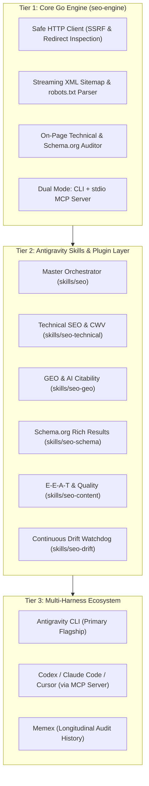

# Antigravity SEO & GEO Suite

A high-performance SEO and Generative Engine Optimization (GEO) suite built natively for **Google Antigravity CLI & IDE**, powered by a high-speed **Go engine** and multi-agent skills.

Combines transport-level network inspection and high-concurrency crawling with Antigravity’s native AI search evaluation, live SERP exploration (`search_web`), and interactive UI Artifacts.

---

## Architecture Overview



---

## Features

* **Zero Python Runtime Overhead**: No virtual environments, no `pip`, and no broken Playwright daemons. Single static Go binary starts in under 10ms.
* **First-Class AI Citability (GEO)**: Designed around Google's AI Optimization Guide, evaluating content for front-loaded answers, entity salience, and `/llms.txt` presence.
* **Live SERP & Gap Intelligence**: Leverages Antigravity's `search_web` to discover ranking competitors, People Also Ask (PAA) questions, and content gaps for free.
* **High-Speed Sitemap Discovery**: Discovers and streams 100+ child sitemaps in under 250ms with zero memory bloat.
* **AI Bot Policy Auditing**: Inspects access permissions for `Googlebot`, `Google-Extended`, `GPTBot`, `OAI-SearchBot`, `ClaudeBot`, `PerplexityBot`, and `Applebot-Extended`.
* **Universal MCP Server**: Runs over `stdio` for instant integration into Claude Code, Codex, and Cursor.
* **Autonomous Drift Monitoring**: Built-in `schedule` cron runbook for nightly regression checks.
* **Cross-Session Memory with Memex**: Compares technical scores and schema deprecations against prior audits.

---

## Quick Start (CLI)

Build the binary:
```bash
cd /apps/antigravity-seo
go build -buildvcs=false -o bin/seo-engine ./cmd/seo-engine
```

Inspect transport headers & redirect hops:
```bash
./bin/seo-engine headers https://nipponhomes.com
```

Perform full on-page technical and schema audit:
```bash
./bin/seo-engine audit https://nipponhomes.com
```

Stream and validate an XML sitemap:
```bash
./bin/seo-engine sitemap https://nipponhomes.com/sitemap-index.xml --limit 10
```

Inspect robots.txt directives and AI crawler policies:
```bash
./bin/seo-engine robots https://nipponhomes.com
```

---

## Antigravity Plugin Setup

To make the skills and rules globally discoverable in Antigravity:

```bash
mkdir -p ~/.gemini/config/plugins
ln -s /apps/antigravity-seo ~/.gemini/config/plugins/antigravity-seo
```

Once installed, simply ask Antigravity in plain English:
* *"Audit the SEO and schema for https://nipponhomes.com"*
* *"Check if our site is blocking AI search crawlers in robots.txt"*
* *"Run a technical crawl on our XML sitemap"*

---

## MCP Server Integration

To use the Go engine in other AI assistants:

### Codex CLI (`~/.codex/config.toml`)
```toml
[mcp_servers.seo]
command = "/apps/antigravity-seo/bin/seo-engine"
args = ["serve-mcp"]
```

### Cursor (`.cursor/mcp.json`)
```json
{
  "mcpServers": {
    "seo": {
      "command": "/apps/antigravity-seo/bin/seo-engine",
      "args": ["serve-mcp"]
    }
  }
}
```
